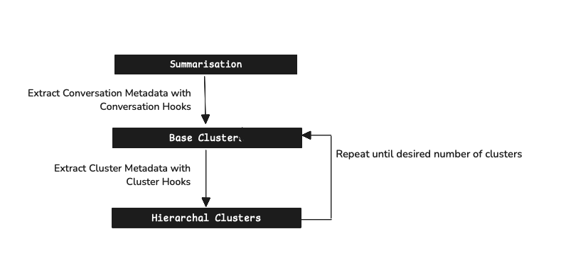

# Introduction

Kura is an open-source tool that helps you to understand your users. It's built using the same ideas as [CLIO](https://www.anthropic.com/research/clio) but open-sourced so that you can try it on your own data. I've written a [walkthrough of the code](https://ivanleo.com/blog/understanding-user-conversations) that you can read to understand the high level ideas behind CLIO.

It's currently under active development and I'm working on adding more features to it but the eventual goal is to make it a very modular tool that you can use to understand general trends in your user base. If you face any issues or have any suggestions, please feel free to open an issue or a PR.

At it's core, Kura exposes the following few features as shown in the diagram below

- A Summarisation Model that takes user conversations and summarises them into a task description
- Summary Hooks that take the same conversations and extract out valuable metadata from them ( that you specify)
- A base clustering model that takes the summaries and clusters them into groups based off their embeddings
- A clustering model that takes these clusters and further clusters them into more groups based off their embeddings

This creates a list of hierachal clusters that are labelled with language models with the metadata that you specify and care about.



Once you've installed the package with the command `pip install kura`, you can use the following initialisation code to get started

```python
from kura import Kura
from kura.embedding import OpenAIEmbeddingModel
from kura.summarisation import SummaryModel
from kura.dimensionality import DimensionalityReduction
from asyncio import run

kura = Kura(
    embedding_model=OpenAIEmbeddingModel(),
    summarisation_model=SummaryModel(),
    dimensionality_reduction=DimensionalityReduction(),
    max_clusters=10,
    checkpoint_dir="./checkpoints",
)
kura.load_conversations("conversations.json")
run(kura.cluster_conversations())

```

We expose the following parameters that you can use
